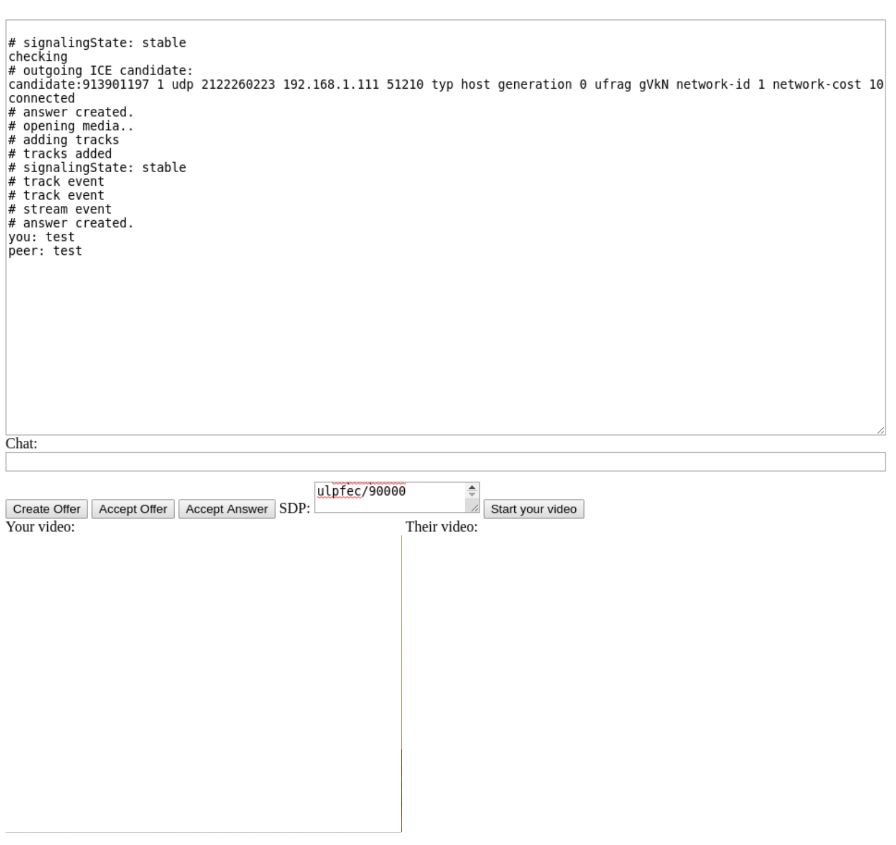

# serverless-webrtc-testbench

This is a minimal WebRTC application that works without a signalling server.

Normally, a signalling server would be used to exchange SDP(Session Description Protocol) offers and answers.

For this sample, you would need to exchange this information by copying and pasting offers and answers manually between computers/browser tabs for it to work.

This sample can be used as a testbench to understand how signalling works in a WebRTC application.

To keep it as simple as possible, all code is in a single html file.

## Test it

- Serve the index.html on a static file server(Such as node http-server) or you can open the file directly in your browser if you want to just do a local test between two open tabs.

***important*: You will need to serve index.html over https(possibly with a self-signed certificate) if you want to test it over multiple computers due to browser security restrictions on WebRTC applications.**

- Open it on separate tabs/computers.

- Create an offer on one client. Once created, it will be inserted into the SDP field.

- Copy the value in the SDP field to the other client and trigger accept offer. The answer will be inserted into the SDP field.

- Copy the answer back into the initial client's SDP field and trigger accept answer. Now the connection should be established and you should be able to chat over a WebRTC DataChannel.

- If you want to start video & audio transfer, use the "Start your video" button and repeat the offer/answer process.

Tested on:

- Chrome 80.0.3987.106 (Official Build) (64-bit)

- Firefox 73.0 (64-bit)

## References

Mozilla documentation: https://developer.mozilla.org/en-US/docs/Web/API/WebRTC_API/Signaling_and_video_calling

https://stackoverflow.com/a/54985729